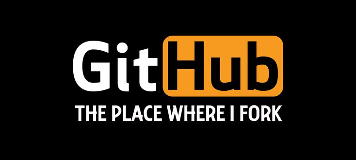

<p align="center">
  
</p>

<p align="center">
  
</p>

## 🎯 About Me

<table>
<tr>
<td width="58%" valign="top">

```typescript
const shuvankar = {
    role: "Web3 & Blockchain Developer",
    location: "Kharagpur, India 🇮🇳",

    building: [
        "Smart Contracts",
        "Decentralized Applications (dApps)",
        "DeFi Protocols"
    ],

    learning: [
        "Zero-Knowledge Proofs",
        "Soroban Smart Contracts",
        "System Architecture"
    ],

    tech: {
        contracts: ["Solidity", "Rust (Soroban)"],
        frontend: ["React", "Next.js", "Tailwind"],
        web3: ["Ethers.js", "Web3.js", "Hardhat"],
        tools: ["Docker", "Git", "Linux"]
    }
};
```

<br>


</td>

<td width="42%" align="center">


</td>
</tr>
</table>

<br>

## 🌐 Connect with Me

<p align="center">
  <a href="https://x.com/Shuvankar112">
    
  </a>
  &nbsp;
  <a href="mailto:kgp.shuvankar112@gmail.com">
    
  </a>
  &nbsp;
  <a href="https://github.com/Shuvankar11">
    
  </a>
  &nbsp;
  <a href="https://komarev.com/ghpvc/?username=Shuvankar11&label=VIEWS&style=for-the-badge&color=8B5CF6">
    
  </a>
</p>

<br>

## 🛠️ Tech Stack

<p align="center">
  
</p>

<br>

<table>
<tr>
<!-- LEFT COLUMN -->
<td width="50%" align="center">

<h3>⛓️ Blockchain &amp; Web3</h3>

<p align="center">
  
  
  
  
  
  
  
</p>

</td>

<!-- RIGHT COLUMN -->
<td width="50%" align="center">

<h3>☁️ Tools &amp; Workflow</h3>

<p align="center">
  
</p>

<p align="center">
  
  
  
</p>

</td>
</tr>
</table>

<br>

## 📊 GitHub Analytics

<p align="center">
  
</p>

<p align="center">
  
  
</p>

<p align="center">
  
  
</p>

<p align="center">
  
</p>

<br/>

<p align="center">
  <i>"Building the future of decentralized networks, one block at a time!"</i> ⚡
</p>

---

<p align="center">
  
</p>
